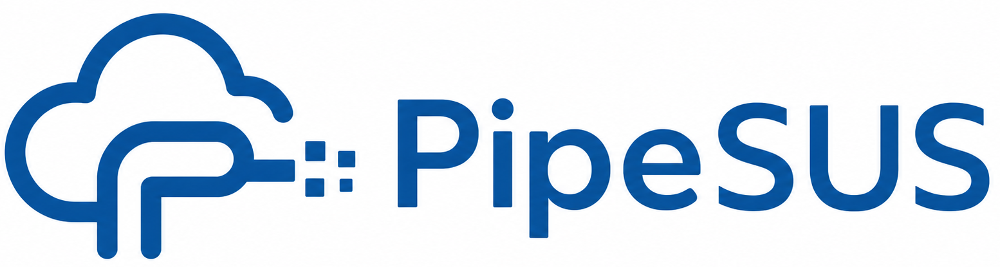
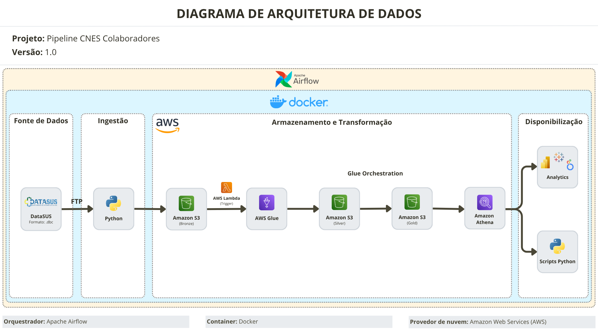

---

# PipeSUS


---
## Quick Start

Execute a pipeline localmente para realizar a ingestão automatizada de dados do CNES no S3 (Camada Bronze).

**Linux/macOS/WSL**
```bash
git clone https://github.com/thiisaback/pipesus.git
cd pipesus
cp .env.example .env
```

Configure o arquivo `.env` com suas credenciais AWS, região AWS e o nome do bucket S3 antes de rodar o comando abaixo.
```bash
docker compose up --build
docker compose down
```
> ⚠️ Atualmente, o projeto implementa apenas a **fase de ingestão (Camada Bronze)**.

> 📖 *Precisa de ajuda para configurar a AWS ou executar o projeto? Consulte o passo a passo:*
> - [Configurando a Política na AWS](docs/01-config-aws-politica.md)
> - [Criando o usuário IAM para o projeto na AWS](docs/02-config-aws-usuario.md)
> - [Criando chaves de acesso na AWS](docs/03-key-aws.md)
> - [Configurando as variáveis de ambiente](docs/04-config-env.md)
> - [Executando a ingestão via Docker Compose](docs/05-execucao-docker.md)

---

## 1. O que é o PipeSUS?

O **PipeSUS** é uma pipeline de dados com arquitetura orientada a eventos, projetada para ingestão, armazenamento e disponibilização de dados públicos do DataSUS em uma arquitetura *serverless* na AWS.

## 2. Valor de Negócio

No setor de saúde brasileiro, a consistência dos dados cadastrais é essencial para garantir *compliance* regulatório e eficiência financeira. O Cadastro Nacional de Estabelecimentos de Saúde (CNES) é o registro oficial do Ministério da Saúde. Divergências entre sistemas internos (como RH) e o CNES podem gerar riscos como:

- Glosas financeiras
- Inconsistências cadastrais
- Falhas em auditorias

**O Problema:** O cruzamento entre bases internas e públicas ainda é majoritariamente manual, sujeito a erros e alto custo operacional.

**A Solução:** O PipeSUS propõe uma pipeline de dados escalável na AWS, com ingestão automatizada de dados do DataSUS. Atualmente, a pipeline:

1. Extrai dados via FTP do servidor do DataSUS (formato legado `.dbc`).
2. Realiza o *upload* para o Amazon S3 (Camada Bronze).
3. Mantém os dados brutos e imutáveis.

**Impacto e Visão Estratégica:**
- **Automação:** Elimina processos manuais de coleta de dados.
- **Governança:** Cria uma base confiável e auditável.
- **Escalabilidade:** Prepara o ambiente para crescimento e novas integrações.
- **Analytics:** Viabiliza o futuro consumo via SQL e ferramentas de BI.

**Ganho Operacional Estimado:**
- Redução de 70 a 90% no tempo de coleta de dados, em comparação ao processo manual
- Eliminação de etapas manuais críticas, reduzindo risco de erro humano
- Padronização do processo de ingestão, permitindo escalabilidade e reuso

---

## 3. Arquitetura do Sistema e Stack Tecnológico

A arquitetura segue o padrão **Medallion**, com separação clara entre camadas de dados. O diagrama abaixo ilustra a arquitetura alvo completa.



---
**Fluxo de Dados**

- **Ingestão (Implementado):** Extração via FTP do DataSUS e *upload* dos arquivos `.dbc` para o S3 (Camada Bronze).

- **Ingestão (Evolução Planejada):** Orquestração via Apache Airflow, com agendamento e controle de execução.

- **Transformação (Planejado):** *Trigger* via AWS Lambda, processamento com AWS Glue, conversão para `.parquet` e limpeza dos dados.

- **Armazenamento:** Bronze (dados brutos), Silver (dados tratados - *planejado*) e Gold (dados refinados - *planejado*).

- **Disponibilização (Planejado):** Consultas via Amazon Athena e integração com ferramentas de BI e outras aplicações.

---

## 4. Tecnologias e Ferramentas Utilizadas

- **Linguagem:** Python 3.12
   - Bibliotecas principais: `ftplib`, `boto3`
- **Amazon Web Services (AWS):**
   - **Amazon S3:** Data Lake (Camadas Bronze, Silver e Gold)
   - **IAM:** Gestão de acessos
   - **AWS Lambda (*planejado*):** Execução orientada a eventos
   - **AWS Glue (*planejado*):** Processamento distribuído da transformação dos dados
   - **Amazon Athena (*planejado*):** Consultas SQL *serverless*
- **Containerização:** Docker e Docker Compose
- **Orquestração da Ingestão (planejado):** Apache Airflow
---

## 5. Estrutura do Repositório
```text
├── logs/                   # Arquivos de log gerados durante a execução local
├── notebooks/              # Jupyter Notebooks para exploração inicial dos dados
├── src/
│   ├── ingestao/           # Scripts Python de extração do FTP (CNES)
│   ├── lambda/             # Código fonte da função AWS Lambda
│   ├── glue_jobs/          # Scripts dos jobs do AWS Glue
│   └── utils/              # Funções auxiliares e módulos compartilhados
├── docs/                   # Documentação detalhada (configurações AWS, IAM etc.)
├── .dockerignore           # Arquivos ignorados na build da imagem Docker
├── .env.example            # Template para variáveis de ambiente
├── .gitignore              # Arquivos e pastas ignorados pelo Git
├── docker-compose.yml      # Orquestração dos containers locais
├── Dockerfile              # Receita para construção da imagem Docker do projeto
├── main.py                 # Script principal de execução da pipeline
├── README.md               # Documentação principal
└── requirements.txt        # Dependências do projeto Python
```
---

## 6. Decisões de Arquitetura

- **Arquitetura Medallion:** Separação estrita entre dados brutos, tratados e analíticos para evitar retrabalho de extração em caso de falhas nas regras de negócio.

- **S3 como Data Lake:** Escolhido pelo baixo custo e alta escalabilidade.

- **Retenção do formato `.dbc` na Camada Bronze:** Os arquivos no formato legado `.dbc` do DataSUS são transferidos nesse formato para a nuvem, transferindo o gargalo computacional da descompressão para o processamento distribuído da AWS (Fase 2).

- **Logs e Rastreabilidade:** A ingestão gera logs locais estruturados na pasta `/logs` para auditoria do que foi extraído e carregado.

---

## 7. Resultado da Execução da Pipeline

A execução da pipeline resulta na ingestão estruturada dos dados do DataSUS no Data Lake, conforme descrito abaixo.

Os dados são armazenados no Amazon S3 na Camada Bronze, mantendo o formato original `.dbc`, garantindo a imutabilidade e rastreabilidade dos dados brutos. Essa abordagem permite reprocessamento completo dos dados em etapas posteriores da pipeline, sem dependência da fonte original.

**Exemplo de estrutura no Data Lake:**
```text
s3://<bucket>/bronze/cnes/profissionais/PFRJ2603.dbc
```

Os arquivos são armazenados seguindo uma estrutura organizada por camada, fonte e domínio de dados, facilitando organização e futuras estratégias de particionamento e consulta.

Além disso, logs da execução são gerados na pasta `/logs`, registrando todas as etapas da ingestão.

---

## 8. Roadmap de Evolução da Pipeline

Este projeto está sendo desenvolvido de forma iterativa. A fase atual contempla a **Ingestão (Camada Bronze)**. Abaixo estão listadas as etapas da arquitetura que serão implementadas:

- [x] **Fase 1: Ingestão de Dados** (Concluído)
   - Extração automatizada via scripts Python do FTP do DataSUS.
   - Carga dos dados brutos no Amazon S3 (Camada Bronze).
   - Containerização da aplicação via Docker

- [ ] **Fase 2: Processamento**
   - Configuração do **AWS Lambda** para atuar como *trigger* automático na chegada de novos arquivos no S3.
   - Desenvolvimento dos Jobs no **AWS Glue** para conversão de `.dbc` para `.parquet`.
   - Limpeza, tipagem e transição dos dados para a Camada Silver.

- [ ] **Fase 3: Camada Analítica e Disponibilização**
   - Refinamento dos dados para a Camada Gold (focada em regras de negócio).
   - Configuração do Amazon Athena para viabilizar consultas SQL *serverless*.

- [ ] **Fase 4: Refinamento da Engenharia**
   - Orquestração do fluxo de ingestão utilizando **Apache Airflow**.
   - Provisionamento de toda a infraestrutura da nuvem via código (**Terraform**).

---
   
## 9. Contato

Projeto desenvolvido como parte do meu portfólio pessoal de Engenharia de Dados, com foco em resolver problemas reais de negócios utilizando arquitetura moderna de nuvem.

Se quiser trocar ideias sobre o projeto, o mercado ou engenharia de dados, fique à vontade para me contatar.

---

### **Thiago Saback**

**LinkedIn:** [https://www.linkedin.com/in/thiago-saback/](https://www.linkedin.com/in/thiago-saback/)

**E-mail:** [thiisaback@gmail.com](mailto:thiisaback@gmail.com)

---